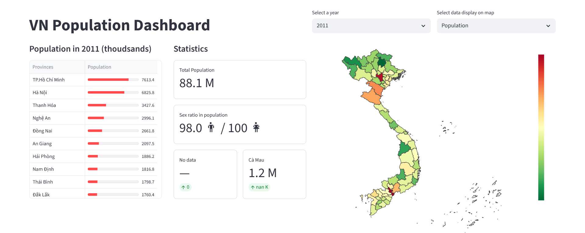

# Mini project: Vietnam Population Dashboard 

Simple visualization of Vietnam population from 2011 to 2024.

*Heavy inspiration from Streamlit [guide](https://blog.streamlit.io/crafting-a-dashboard-app-in-python-using-streamlit/) to making good dashboard.*

# 1. Visual components

There are 3 metrics considered:
1. How do total populations compare among different provinces?
-> Choropleth map for `Population` and `Population desity` to compare the difference between population between provinces. The displayed values are log transformed for better comparison, while hover data state the real value before transformed. 

2. How do state populations evolve over time and how do they compare to each other?
-> Metrics for top population gain/loss per year.

3. How do we undrestand the composition of the population better?
-> Metrics for sex ratio within the poputions

In addition, a dataframe of province population is also display for easy search.

# 2. Data processing 

1. Vietnam population data:
- Text encoding errors are preprocessed using `pandas`.
- All data is taken from [National Statistics Office of Vietnam](https://www.nso.gov.vn/px-web-2/?pxid=V0201&theme=D%C3%A2n%20s%E1%BB%91%20v%C3%A0%20lao%20%C4%91%E1%BB%99ng).

2. Map data:
- Vietnam geographical map data is taken from [Open Development Vietnam](https://data.vietnam.opendevelopmentmekong.net/vi/dataset/a-phn-tnh) with rendering guidance from [Github - Vietnam Choropleth Map](https://github.com/lebinh/vietnam-choropleth-map/tree/master) by [lebinh](https://github.com/lebinh).

# 3. Functions 

- View geographical changes in `Population` or `Population density` from 2011 to 2024. 
- View changes in  `Total population`, `Sex ratio`, top population gain/loss provinces and list of population by province from 2021 to 2024. 